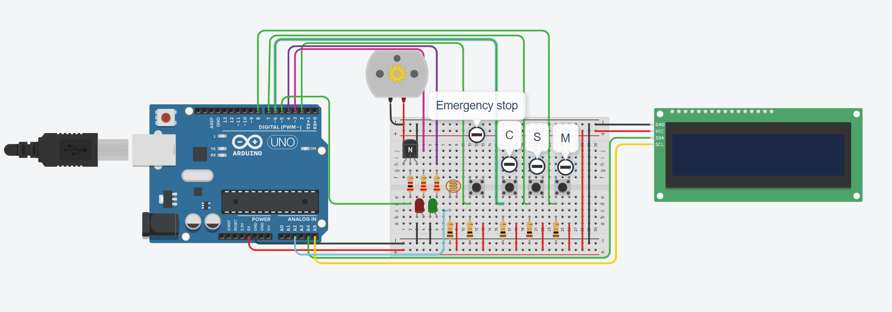

# BTEC-Engineering-Unit-6
The code project I used in my Engineering BTEC unit 6

## Client brief:

The brief this year was to create a luggage wrapper that can accomodate two sizes of parcels, a small one that lasts for 5 seconds and a large one that lasts for 10 seconds as well as a continue option that adds an extra 5 seconds on. When the parcel is placed onto the machine and the user presses the button it turns on a dc motor for that length of time. There needed to be an lcd that communicates what is going on to the user as well as a light dependent resistor that means the motor only turns on when there is actually a parcel on the machine. An emergency stop was also required which needed to stop everything in case of an accident.

## component layout:



This was the layout of the components I used.

## code breakdown:

I start by including the Liquid Crystal I2C library that is required to communicate with the lcd I am using for this project, this library automatically determines the analog pins that I am using (A4 & A5). 
The dimensions and address of the lcd are defined in the syntax: `LiquidCrystal_I2C lcd(I2C_address, columns, rows);` 
Then I start declaring the pin for the dc motor, the motor state - a boolean that is either true for on or false for off, and the on duration that tells the arduino the time at which the motor needs to be turned off. 
The red and green LEDs have their pins declared here with `const int` as they will not change during the program.
Then I move onto the buttons starting with the LDR which requires an analog pin as it is an analog value (ranges from 0 - 1023). As it is an input I also have to create a int to store its value.
I then define emergencyStop using pin 2 as it is one of the only pins an interrupt can be attached to, which is why it's value is a `volatile bool` instead of a normal boolean.
The other three buttons; continue, small and medium are declared and have their states stored as normal integers. 

`void setup()`

In void setup I declare the pins as either inputs or outputs, depending on the components attached to them, here I also have to attach the interrupt to the emergency stop button with the interrupt name (ISR) and type (for type I chose falling as I want the interrupt to happen when the button goes from high to low). I then initialise the lcd display and print "select small, medium or continue" in the lines: 
```
lcd.init(); 
lcd.backlight(); 
lcd.setCursor(0,0); 
lcd.print("Select small, me-"); 
lcd.setCursor(0,1); 
lcd.print("dium or continue:");
```
`void loop()`

In void loop I first read all of the inputs and assign them to the relevant variable, Then I created a if loop that triggers when one of the buttons is pressed, this does as follows: 

- If the light level is too high:
  - it tells the user to place a suitcase on the machine
  - reads the light sensor value
- If the light level within range:
  - clears the lcd
  - prints option selected
  - moves the cursor to the second line (to prepare to print which button was pressed)
  - turns on the motor
  - sets the motor state to true

There are then a series of if and else if statements that print the button that was pressed, and sets the on duration accordingly. 

I then check if the motor is on or not: 
- If it is on:
 - turn on the red LED
 - turn off the green LED
- If it is off:
 - turn off the red LED
 - turn on the green LED

Then when the motor is on and the required duration is over I:
- turn off the motor
- set the motor value to false
- clear the lcd
- print "complete"

The final if statement is for the emergency stop button which, when activated;
 - prints "emergency stop"
 - turns off the motor
 - sets the motor state to false
 - turns off the red LED
 - turns on the green LED 

`void stopNow()`

This is the interrupt and when called it sets the emergencyStopValue as true so that the final if statement can be entered by the program.